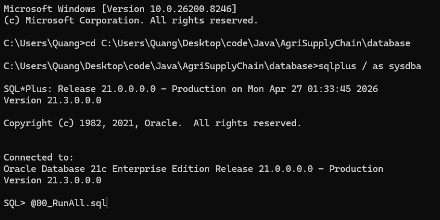
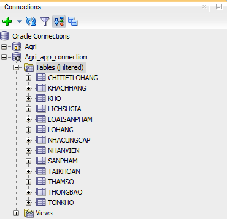

# Hướng dẫn khởi tạo Database (Oracle) bằng script `00_RunAll.sql`

---

# ⚠️ LƯU Ý QUAN TRỌNG (ĐỌC TRƯỚC KHI CHẠY)

Trước khi chạy script, hãy đảm bảo các điều kiện sau:

---

## 🧱 1. Phải tồn tại PDB tên `orclpdb`

- Script sử dụng service với tên: orclpdb

👉 Nếu máy bạn không có PDB này -> script sẽ lỗi

---

### ✅ Cách kiểm tra:

Mở SQL*Plus và chạy:

```
SHOW PDBS;
```

👉 Bạn phải thấy: orclpdb

---

### ❌ Nếu KHÔNG có

👉 Có 2 cách:

- Sửa script từ `orclpdb` thành `MY_ORCLPDB` *(tên PDB của bạn)*
- Hoặc tạo PDB mới với tên `orclpdb`

---

## 🔌 2. Oracle Database phải đang chạy

👉 Kiểm tra nhanh:

```
lsnrctl status
```
👉 Phải thấy service orclpdb ở trạng thái READY

## 📂 3. Phải chạy script từ đúng thư mục

👉 Rất quan trọng

- File `00_RunAll.sql` sẽ gọi các file:
- `01_Tables.sql`
- `02_Sequences.sql`
- ...

👉 Nếu sai thư mục -> database sẽ KHÔNG được tạo

---

## 🧠 4. Script sẽ XÓA toàn bộ dữ liệu cũ

👉 Khi chạy:

- User `AGRIAPP` sẽ bị DROP
- Toàn bộ bảng và dữ liệu sẽ mất

---

# 🚀 CÁC BƯỚC THỰC HIỆN

---
## Tạo Database
1. Nhấn `Window + R`, nhập `cmd`.
2. Dùng `cd` để di chuyển đến thư mục chứa script sql. VD: `cd code\Java\AgriSupplyChain\database`
3. Nhập `sqlplus / as sysdba` hoặc `sqlplus sys/yourpassword@localhost:1521/orclpdb as sysdba`
4. Nếu thấy `SQL>` hiện ra thì tiếp nhập `@00_RunAll.sql` để chạy script


## Kiểm tra kết quả
1. Mở SQLDeveloper
2. Tạo connection
    - username = `AGRIAPP`
    - password = `1234561`
    - role = default
    - hostname = localhost
    - port = 1521
    - service name = orclpdb
3. Ở tab connections bên trái, mở phần **Tables** ra xem đã có đủ các bảng chưa
